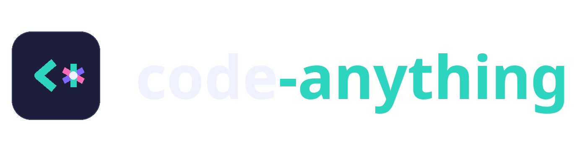

# Code Anything

> **The agent ops layer for AI coding CLIs — session-safe setup, zero-token code intelligence, measured agent routing.**

[](LICENSE)

[](https://www.npmjs.com/package/code-anything)
[](https://github.com/siddharthgosavi/code-anything/actions/workflows/ci.yml)

## Status

**v1.0.0 published to npm.** Honest scope of claims:
- ✅ Tested: 12 suites incl. routing golden-set eval, catalog parity guard, and hook safety — see `npm test` and [CI](.github/workflows/ci.yml).
- ⚠️ Routing accuracy is a **regression guard** on a 44-case golden set ([ADR-002](docs/adr/ADR-002-deterministic-router-with-eval-gate.md)), not a semantic-quality claim; deterministic v1 scorer.
- ⚠️ Built against OpenCode plugin API `1.18.x`; relies on `experimental.session.compacting` (unstable by name).
- ✅ **`npx code-anything` is live** ([npm](https://www.npmjs.com/package/code-anything)). The package was renamed from `everything-opencode` ([ADR-004](docs/adr/ADR-004-package-rename-code-anything.md)).
- 🔲 CI publishes future `v*` tags automatically once an `NPM_TOKEN` repo secret is configured (or npm trusted publishing); v1.0.0 was published manually.

---

## Quick Start: One Command Setup

Adapted from the patterns of [everything-claude-code](https://github.com/worldflowai/everything-claude-code), re-architected for OpenCode with native **Graphify Code Intelligence**, model flexibility, lifecycle hooks that never touch your sessions, and test-gated configuration merges.

Configure OpenCode in your project with one command:

```bash
npx code-anything
```

Or install globally for all projects:

```bash
npx code-anything install --global
```

That's it! Your OpenCode setup is immediately equipped with:
- **10 Specialized Subagents** (`planner`, `architect`, `tdd-guide`, `code-reviewer`, `security-reviewer`, `build-error-resolver`, `e2e-runner`, `refactor-cleaner`, `doc-updater`, `graph-analyst`)
- **14 Slash Commands** (`/plan`, `/tdd`, `/verify`, `/code-review`, `/build-fix`, `/refactor-clean`, `/e2e`, `/test-coverage`, `/update-docs`, `/checkpoint`, `/learn`, `/graph-query`, `/graph-build`, `/setup-pm`)
- **12 Modular Skills** (`graphify-intelligence`, `tdd-workflow`, `verification-loop`, `backend-patterns`, `frontend-patterns`, `coding-standards`, `continuous-learning`, `eval-harness`, `security-review`, `strategic-compaction`, `agent-orchestrator`, `clickhouse-io`)
- **First-Class Graphify Integration** (instant AST dependency graphs, call flow queries, community clustering)
- **Safe Session Protection** (never terminates or disturbs your active OpenCode sessions)

---

## Graphify Code Intelligence

Unlike Claude Code configurations that rely on naive text grep or expensive manual codemaps that burn tens of thousands of tokens, `code-anything` natively integrates with **[Graphify](https://github.com/worldflowai/graphify)**.

### Why Graphify?
- **Zero Token AST Parsing**: Indexes codefiles in milliseconds using local Tree-Sitter AST parsers.
- **Precision Subgraphs**: Query exact callers, callees, and dependencies instead of endless grep noise.
- **Community Clustering**: View architectural clusters and god-node bottlenecks in `graphify-out/GRAPH_REPORT.md`.

### Using Graphify with OpenCode:
```bash
# Build knowledge graph for current project (code-only, fast, zero API cost)
npx code-anything graphify init

# Query relationships for a function or symbol
npx code-anything graphify query "authMiddleware"

# Check graph status
npx code-anything graphify status
```

In OpenCode:
- Type `/graph-query <symbol>` to run relationship queries on demand.
- Type `/graph-build` to refresh the AST knowledge graph.
- The `graph-analyst` subagent automatically analyzes architecture and blast radius before large refactors.
- Built-in `tool.execute.before` hook proactively advises the agent to use the knowledge graph instead of slow grepping.

---

## Flaws of everything-claude-code Fixed

`code-anything` directly resolves the core flaws and architectural limitations of `everything-claude-code`:

1. **Graphify vs. Manual Codemaps**: Replaced expensive, text-based markdown codemaps (which burned 50k+ tokens and quickly decayed) with real Tree-Sitter AST knowledge graphs.
2. **Dynamic Model Selection vs. Hardcoded Opus**: `everything-claude-code` hardcoded `model: opus` in every agent, breaking when users lacked Anthropic API keys or used local/alternative models. `code-anything` defaults to `inherit` (using your active session model) and offers flexible presets (`openai`, `google`, `anthropic`, `explabs`, `github`).
3. **Native OpenCode Schema vs. Claude Markdown Commands**: Converted freeform markdown command prompts into schema-compliant OpenCode commands with `$ARGV` substitution and agent delegation.
4. **Non-Intrusive Hooks vs. Hard Blocking**: Removed anti-patterns like blocking dev servers outside tmux or violently blocking file creation for non-whitelisted markdown files (`process.exit(1)`).
5. **100% Cross-Platform Node.js**: Eliminated platform-dependent bash scripts (`.sh`) and unhandled `globalThis.Bun` bugs. Runs on Node.js 18+, Bun, Linux, macOS, and Windows.
6. **Pre-Compaction Memory Snapshots**: Uses OpenCode's native `experimental.session.compacting` hook to dump structured state snapshots before context reduction, avoiding context amnesia without polluting start prompts.
7. **One-Command NPX Setup**: Eliminated manual symlink management and config surgery in favor of a single `npx code-anything` command with atomic `.bak` backups.

*For full architectural analysis, see [FLAWS_FIXED.md](FLAWS_FIXED.md).*

---

## Active Session Safety Guarantee

If you have existing, long-running OpenCode sessions:
- `code-anything` **NEVER** terminates, signals, or kills running `opencode` processes.
- All configuration edits are **non-destructive**: your existing providers (e.g. ExperientialLabs, OpenAI, Anthropic), custom API keys (e.g. `explabs.key`), custom MCP servers, and existing plugins (e.g. `@upstash/context7-opencode`) are 100% preserved.
- Automatic backups (`opencode.jsonc.bak`) are created before writing any changes.

---

## Two-Tier Agent Architecture

`code-anything` features a unique two-tier agent architecture:
1. **Tier 1: 10 Core Orchestrator Agents** (pre-configured with slash commands & AST knowledge graphs).
2. **Tier 2: 279 Agency Specialist Agents** across 18 specialized divisions (curated from [msitarzewski/agency-agents](https://github.com/msitarzewski/agency-agents)), installable on-demand or callable as `@<slug>` subagents.

---

## Core Meta-Agents (Tier 1)

| Agent | Scope & Role | Tools Permitted |
| :--- | :--- | :--- |
| `planner` | Phased implementation planning, risk assessment. **Read-only** until confirmation. | `bash, read, glob, grep, task, webfetch, skill` |
| `architect` | High-level system design, module boundaries, data models, scalability trade-offs. | `bash, read, glob, grep, task, webfetch, skill` |
| `tdd-guide` | Enforces Red-Green-Refactor cycles and >= 80% test coverage. | `bash, read, glob, grep, edit, write, task, skill` |
| `code-reviewer` | Senior review of recent changes: correctness, security, performance, clean code. | `bash, read, glob, grep, task, skill` |
| `security-reviewer` | Vulnerability auditing: OWASP Top 10, injection, secrets, authorization bypasses. | `bash, read, glob, grep, task, skill` |
| `build-error-resolver` | Multi-language compiler debugger (Rust, Go, TypeScript, Python, C++). | `bash, read, glob, grep, edit, write, task, websearch, skill` |
| `e2e-runner` | Playwright/Cypress end-to-end testing and user journey verification. | `bash, read, glob, grep, edit, write, task, websearch, skill` |
| `refactor-cleaner` | Eliminates dead code, reduces cognitive complexity, modernizes syntax. | `bash, read, glob, grep, edit, write, task, skill` |
| `doc-updater` | Keeps README.md, AGENTS.md, and API references synchronized with code. | `bash, read, glob, grep, edit, write, task, skill` |
| `graph-analyst` | Explores Graphify knowledge graph, blast radius, callers/callees, and dead code. | `bash, read, glob, grep, task, skill` |

---

## Agency Specialist Roster (Tier 2 - 279 Agents)

Equip OpenCode with 279 specialized agent personas spanning 18 real catalog divisions. All technical division agents come with native **Graphify Code Intelligence** instructions pre-injected.

### Agency Divisions (actual `agents/agency/divisions.json` counts)
- **Engineering (64)**: `database-optimizer`, `api-platform-engineer`, `devops-automator`, `platform-engineer`, `sre-site-reliability-engineer`, `backend-architect`, `ai-engineer`, `data-engineer`, `rag-pipeline-engineer`, `frontend-developer`, etc.
- **Specialized (59)**: cross-domain experts (`model-qa-specialist`, `pricing-analyst`, `supply-chain-strategist`, etc.)
- **Marketing (36)** · **Game Development (21)** · **GIS (13)** · **Security & Compliance (12)** · **Design & UI/UX (10)** · **Testing & QA (9)** · **Sales (9)** · **Paid Media (7)** · **Project Management (7)** · **Academic (6)** · **Spatial Computing (6)** · **Support (6)** · **Finance (5)** · **Product (5)** · **Healthcare (3)** · **Research (1)**

### Agency CLI Management
```bash
# List all 18 divisions and counts
npx code-anything agency list

# List agents in a specific division
npx code-anything agency list --division engineering

# Search agents across all 279 personas by role or keyword
npx code-anything agency search "postgres"
npx code-anything agency search "kubernetes"
npx code-anything agency search "accessibility"

# Install specific agents into current project (.opencode/agents/)
npx code-anything agency install database-optimizer rag-pipeline-engineer

# Install an entire division pack
npx code-anything agency install --division engineering

# Install all 279 agents globally (~/.config/opencode/agents/)
npx code-anything agency install --all --global
```

In OpenCode, you can call any installed agency agent directly using `@<slug>`, for example:
> *"@database-optimizer please analyze our PostgreSQL indexing strategy in `src/db/schema.ts`"*

---

## Available Slash Commands

- `/plan [task]` - Create a phased plan and wait for confirmation.
- `/tdd [target]` - Implement via test-driven development.
- `/verify` - Run the complete verification loop (lint, types, tests, build).
- `/code-review` - Conduct a senior code review on the git diff.
- `/build-fix` - Diagnose and resolve compiler errors.
- `/refactor-clean` - Remove dead code and simplify logic.
- `/e2e [flow]` - Generate and run Playwright E2E tests.
- `/test-coverage` - Measure and boost coverage to >= 80%.
- `/update-docs` - Sync documentation with recent changes.
- `/checkpoint` - Save progress snapshot for session resumption.
- `/learn` - Extract patterns and conventions discovered during the session.
- `/graph-query [symbol]` - Query codebase knowledge graph via Graphify.
- `/graph-build` - Build or refresh the Graphify AST knowledge graph.
- `/setup-pm [manager]` - Configure preferred package manager.

---

## Model Presets

By default, all agents use `inherit` to run with your active session model.
If you prefer dedicated models per agent role, select a preset:

```bash
# View available presets
npx code-anything preset list

# Install with a specific preset
npx code-anything install --preset google
npx code-anything install --preset openai
npx code-anything install --preset anthropic
npx code-anything install --preset explabs
```

---

## Health Check: Doctor Command

Run the doctor diagnostic tool at any time:

```bash
npx code-anything doctor
```

Outputs:
- OpenCode CLI version and status
- Active running sessions (read-only verification)
- Graphify CLI status & knowledge graph node/edge counts
- Detected package manager (npm, pnpm, yarn, bun)
- Registered agents, commands, and skills

---

## Using as an OpenCode Plugin

You can also load `code-anything` directly via OpenCode's plugin system in your `opencode.json` / `opencode.jsonc`:

```json
{
  "$schema": "https://opencode.ai/config.json",
  "plugin": [
    "code-anything"
  ]
}
```

---

## Running the Test Suite

```bash
npm test
```

Includes test coverage for:
- Session safety & process protection
- Non-destructive JSONC configuration merging
- Plugin lifecycle hooks & guardrails
- Graphify AST extraction & query integration
- Package manager detection
- CLI routing & execution

---

## Credits & Acknowledgements

This project was built with the help of several amazing open-source projects:

- **[everything-claude-code](https://github.com/worldflowai/everything-claude-code)**: We adapted our core lifecycle hooks, routing pipeline, and agent orchestration patterns from this battle-tested repository.
- **[Graphify](https://github.com/worldflowai/graphify)**: Powers all of the zero-token AST code intelligence and semantic blast-radius analysis within the `graph-analyst` and `doctor` commands.
- **[Agency Agents](https://github.com/msitarzewski/agency-agents)**: Provided the incredible 279 specialized agent personas and prompts across 18 divisions, which we migrated into the OpenCode schema to enable Tier-2 routing.

---

## License

MIT © [Siddharth Gosavi](LICENSE) — with the upstream projects credited above.
